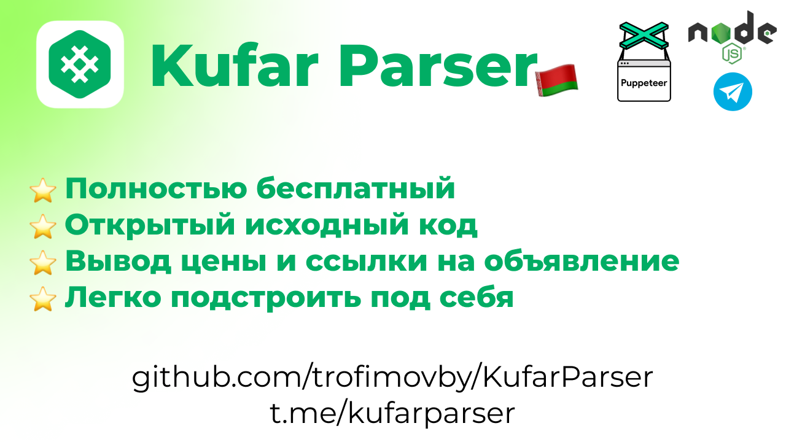

# KufarParser

Этот проект представляет собой парсер, 
который автоматически проверяет обновления на куфаре и отправляет
уведомления о новых объявлениях. Этот инструмент полезен для пользователей, 
которые хотят оперативно получать информацию о новых предложениях, 
таких как объявления о продаже, аренде недвижимости, работе и других.


## Инструкция по установке и запуску скрипта для мониторинга объявлений

Этот скрипт используется для мониторинга объявлений на сайте и отправки уведомлений в Telegram при обнаружении новых объявлений.

### Шаг 1: Клонирование репозитория

Скачайте или клонируйте репозиторий с вашим скриптом на ваш локальный компьютер:

```bash
git clone https://github.com/trofimovby/KufarParser
cd KufarParser
```

## Шаг 2: Установка Node.js

Убедитесь, что у вас установлен Node.js. Если его нет, скачайте и установите последнюю версию Node.js с [официального сайта](https://nodejs.org/).

## Шаг 3: Создание файла `.env`

Создайте файл `.env` в корневой директории проекта и добавьте туда следующие строки:

```angular2html
TELEGRAM_BOT_TOKEN=your_telegram_bot_token
TELEGRAM_USER_ID=your_telegram_user_id
PAGE_URL=https://www.kufar.by/l/zhenskij-garderob
```


- `your_telegram_bot_token`: Токен вашего Telegram бота.
- `your_telegram_user_id`: Ваш Telegram user ID.
- `PAGE_URL`: URL страницы, которую хотите мониторить.

## Шаг 4: Установка зависимостей

Откройте терминал, перейдите в директорию вашего проекта и выполните следующую команду для установки необходимых пакетов:

```bash
npm install puppeteer node-fetch
```

### Шаг 5: Запуск скрипта

После установки зависимостей запустите скрипт командой:

```bash
node script.js
```

Убедитесь, что скрипт запущен и работает корректно.
При успешном запуске в ваш Telegram буде
т отправлено сообщение о начале работы скрипта.

## Примечания

- Убедитесь, что переменные окружения в файле `.env` заполнены корректно.
- Проверьте, чтобы у вашего Telegram бота были все необходимые права.
- Убедитесь, что у вас есть доступ к интернету для работы с Puppeteer и API Telegram.
- Скрипт проверяет обновления каждые 10 секунд. Вы можете изменить этот интервал, изменив параметр в функции `setInterval`.
